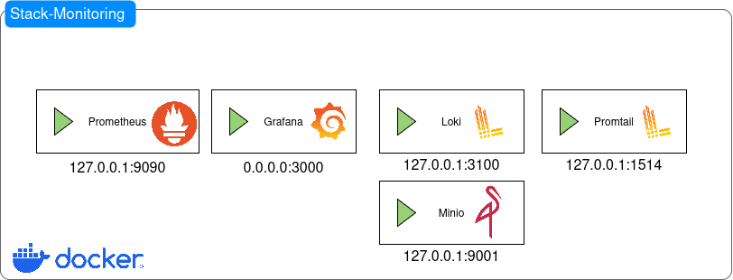
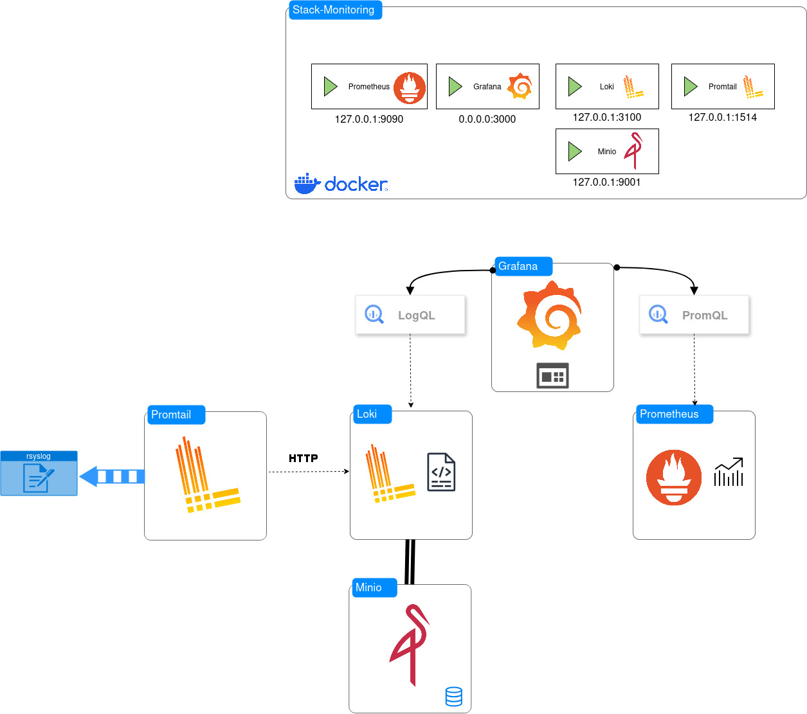
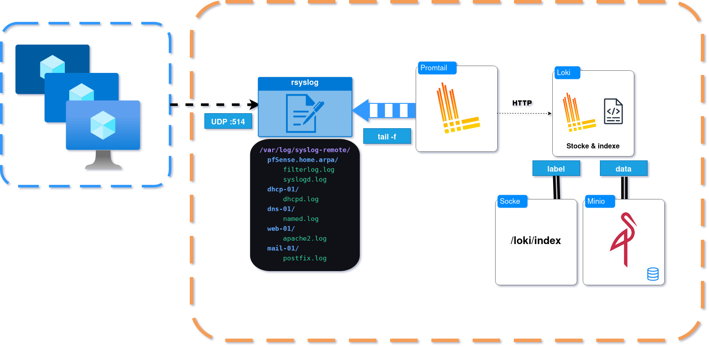
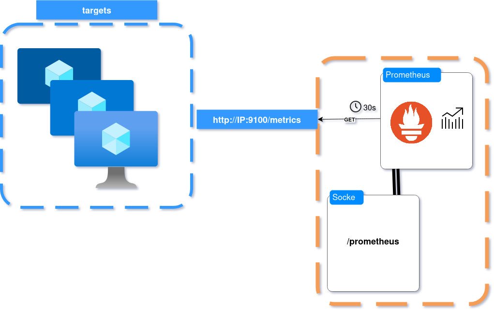

# Stack Monitoring — Groupe 6.2

Stack de supervision Prometheus + Loki + Grafana déployable sur n'importe quelle infrastructure Linux.
Un git clone + 3 commandes suffisent pour avoir un monitoring complet opérationnel.

## Démarrage rapide

```bash
git clone https://github.com/AmonKm/Stack-monitoring.git
cd Stack-monitoring
chmod +x setup.sh
sudo ./setup.sh
```

Le script configure automatiquement l'ensemble du stack en mode interactif : il demande les IPs de vos VMs, le mot de passe Grafana, le hostname pfsense, génère tous les fichiers de configuration et lance Docker Compose.

> Pour une configuration manuelle détaillée, consulter la section *Installation rapide* ci-dessous.

## Architecture

```
Infrastructure cible (groupe 6.1)
──────────────────────────────────────────────────────────────────
 pfSense     Mail      DHCP      DNS       Web      monitoring
    │           │         │        │         │           │
    │     syslog UDP :514 (tous les hosts)   │           │ journald
    └───────────┴─────────┴────────┴─────────┘           │
                          │                               │
    ┌─────────────────────┼───────────────────────────────┘
    │  node_exporter :9100 (tous les hosts)
    └──────────────────────────────────────────────────────
──────────────────────────────────────────────────────────────────
VM monitoring (groupe 6.2)

  [LOGS]                              [MÉTRIQUES]

  rsyslog :1514                       Prometheus
  (reçoit syslog UDP)                 (scrape :9100)
       │                                    │
       │ écrit par host                     │ stocke TSDB
       ▼                                    │
  /var/log/syslog-remote/                   │
    ├── pfSense.home.arpa/                  │
    ├── mail-01/                            │
    ├── dhcp-01/                            │
    ├── dns-01/                             │
    └── web-01/                             │
       │                                    │
       │ lit (tail -f)                      │
       ▼                                    │
    Promtail                                │
       │                                    │
       │ push HTTP :3100                    │
       ▼                                    │
      Loki                                  │
       │                                    │
       │ stocke (S3)                        │
       ▼                                    │
     MinIO                                  │
  (bucket: loki)                            │
                                            │
──────────────────────────────────────────────────────────────────
              Grafana :3000
         ┌────────┴────────┐
        Loki           Prometheus
     (LogQL)           (PromQL)
```
**Stockage** : les chunks de logs Loki sont persistés dans MinIO (compatible S3, bucket `loki`).
Les métriques Prometheus sont stockées en TSDB local sur la VM monitoring.
## Composants

| Composant | Rôle | Port |
|-----------|------|------|
| **Prometheus** | Collecte métriques CPU/RAM/disque/réseau via node_exporter | 9090 (local) |
| **Loki** | Stockage et indexation des logs | 3100 (local) |
| **Promtail** | Lit les fichiers de logs → pousse vers Loki | interne |
| **Grafana** | Dashboards et alertes | 3000 |
| **rsyslog** | Reçoit logs syslog UDP :514 → écrit sur disque | 514 |
| **MinIO** | Stockage objet S3 — backend persistant pour Loki | 9001 (UI), 9002 (API) |

## Versions testées

### VM Monitoring

| Composant | Version |
|-----------|---------|
| OS | Debian 12 (bookworm) |
| Docker | 29.3.1 |
| Docker Compose | v5.1.1 |
| Grafana | **12.0.1** |
| Prometheus | **v3.5.0** |
| Loki | **3.4.3** |
| Promtail | **3.4.3** |
| MinIO | latest |

### Infrastructure cible (groupe 6.1)

| Service | Logiciel | Version |
|---------|----------|---------|
| Firewall | pfSense | 2.7.2 |
| DNS | BIND9 | 9.18.47 |
| Web | Apache2 | 2.4.66 |
| Mail | Postfix | 3.7.11 |
| DHCP | ISC DHCP | 4.4.3-P1 |
| Toutes VMs | node_exporter | 1.8.1 |
| Toutes VMs | OS | Debian 12 (bookworm) |

## Prérequis

### VM Monitoring

- OS : Debian 12 / Ubuntu 22.04+
- RAM : 2 Go minimum
- Disque : 20 Go minimum
- Docker + Docker Compose installés
- rsyslog installé (`sudo apt install -y rsyslog`)
- node_exporter installé (`sudo apt install -y prometheus-node-exporter`)

### VMs à superviser

- node_exporter installé et accessible sur le port `9100`
- Syslog configuré pour envoyer vers la VM monitoring sur le port `514 UDP`

## Installation rapide

### 1. Cloner le dépôt

```bash
git clone https://github.com/AmonKm/Stack-monitoring.git
cd Stack-monitoring
```

### 2. Configurer les variables

```bash
cp .env.example .env
nano .env
```

| Variable | Description | Défaut |
|----------|-------------|--------|
| `GF_ADMIN_USER` | Login Grafana | admin |
| `GF_ADMIN_PASSWORD` | Mot de passe Grafana | changeme |
| `PROMETHEUS_RETENTION` | Durée rétention métriques | 30d |
| `MINIO_ROOT_USER` | Login MinIO | minioadmin |
| `MINIO_ROOT_PASSWORD` | Mot de passe MinIO | changeme123 |

### 3. Configurer rsyslog

```bash
sudo mkdir -p /var/log/syslog-remote
sudo chmod 755 /var/log/syslog-remote
sudo cp docs/rsyslog.conf /etc/rsyslog.d/00-promtail-relay.conf
sudo systemctl restart rsyslog
sudo systemctl enable rsyslog
```

Vérifier que rsyslog tourne sans erreur :

```bash
sudo journalctl -u rsyslog --since "1 minute ago" | tail -5
```

### 4. Adapter les targets Prometheus

Éditer `prometheus/targets/si.yml` avec les IPs de vos VMs :

```yaml
- targets:
    - "10.0.0.10:9100"   # ← remplacer par l'IP réelle
  labels:
    env: "si-principal"
    role: "dns"
    hostname: "dns-01"   # ← hostname affiché dans Grafana

- targets:
    - "10.0.0.11:9100"
  labels:
    env: "si-principal"
    role: "dhcp"
    hostname: "dhcp-01"

- targets:
    - "10.0.0.20:9100"
  labels:
    env: "si-principal"
    role: "web"
    hostname: "web-01"

- targets:
    - "10.0.0.21:9100"
  labels:
    env: "si-principal"
    role: "mail"
    hostname: "mail-01"
```

Éditer `prometheus/targets/firewall.yml` :

```yaml
- targets:
    - "10.0.0.254:9100"   # ← IP de votre firewall
  labels:
    env: "si-principal"
    role: "firewall"
    hostname: "pfsense"
    type: "pfsense"
```

### 5. Adapter Promtail

Éditer `promtail/promtail-config.yml` — adapter les `__path__` selon les hostnames réels de votre infra.

> **Comment trouver les bons hostnames ?** Après avoir démarré rsyslog et configuré les VMs pour envoyer leurs logs : `ls /var/log/syslog-remote/` — les dossiers créés correspondent aux hostnames réels.

```yaml
- job_name: "pfsense-firewall"
  static_configs:
    - targets: ["localhost"]
      labels:
        job: "pfsense"
        host: "pfsense"
        type: "firewall"
        __path__: /var/log/syslog-remote/pfSense.home.arpa/filterlog.log
        #                                ^^^^^^^^^^^^^^^^^^
        #                    remplacer par le hostname réel de votre pfsense
```

### 6. Lancer le stack

```bash
docker compose up -d
docker compose ps
```
**Loki erreur `NoSuchBucket` au démarrage**

Se produit quand Loki démarre avant que le bucket MinIO soit créé (première installation ou volumes recréés).
```bash
# Vérifier l'erreur
docker logs loki --tail=10 | grep NoSuchBucket

# Fix : forcer la recréation du bucket puis relancer
docker compose up -d minio
docker compose run --rm minio-init
docker compose up -d
```

> Ce problème ne se produit qu'à la première installation ou après une suppression des volumes Docker (`docker volume rm`).

Accéder à Grafana : `http://<IP_VM_MONITORING>:3000`

## Intégration pfSense

Dans l'interface web pfSense : **Status → System Logs → Settings**

| Paramètre | Valeur |
|-----------|--------|
| Enable Remote Logging | coché |
| Remote log servers | `<IP_VM_MONITORING>:514` |
| Remote Syslog Contents | Firewall Events + System Events |
| Log message format | syslog (RFC 5424) |

> **Important** : pour que les logs firewall (filterlog) apparaissent, au moins une règle firewall doit avoir l'option **Log** activée dans Firewall → Rules.

## Intégration VMs Linux

Sur chaque VM à superviser :

**1. Installer node_exporter :**

```bash
sudo apt install -y prometheus-node-exporter
sudo systemctl enable --now prometheus-node-exporter
# Vérifier
curl http://localhost:9100/metrics | head -3
```

**2. Configurer l'envoi syslog :**

Créer `/etc/rsyslog.d/forward.conf` :

```
*.* @<IP_VM_MONITORING>:514
```

```bash
sudo systemctl restart rsyslog
```

**3. Vérifier sur la VM monitoring :**

```bash
ls /var/log/syslog-remote/
# Le hostname de la VM doit apparaître comme dossier
```

## Dashboards disponibles

| Dashboard | Source | Contenu |
|-----------|--------|---------|
| pfsense Firewall | Loki | Trafic bloqué/autorisé, top IPs, top ports |
| DHCP & Mail | Loki | Baux DHCP, machines actives, logs mail |
| Système | Prometheus | CPU, RAM, disque, réseau, uptime par VM |
| Cybersécurité | Loki | Ports suspects, DNS, machines réseau |

Les dashboards sont chargés automatiquement au démarrage de Grafana depuis `grafana/dashboards/`.

## Variables à adapter selon l'infra

| Fichier | Ce qu'il faut changer |
|---------|-----------------------|
| `.env` | `GF_ADMIN_PASSWORD`, `MINIO_ROOT_PASSWORD`, `PROMETHEUS_RETENTION` |
| `prometheus/targets/si.yml` | IPs, hostnames et rôles des VMs |
| `prometheus/targets/firewall.yml` | IP du firewall |
| `prometheus/prometheus.yml` | IP de la VM monitoring |
| `promtail/promtail-config.yml` | Hostnames des dossiers dans `/var/log/syslog-remote/` |
| `docs/rsyslog.conf` | Hostname du pfSense si différent de `pfSense.home.arpa` |

## Structure du dépôt

```
Stack-monitoring/
├── setup.sh                        # Script interactif de configuration automatique
├── docker-compose.yml              # Stack principal — Prometheus, Loki, Promtail, Grafana, MinIO
├── README.md
├── .gitignore    
├── .env.example                    # Variables d'environnement → copier en .env
├── prometheus/
│   ├── prometheus.yml              # Config Prometheus (scrape interval, règles)
│   ├── targets/
│   │   ├── si.yml                  # IPs, hostnames et rôles des VMs à superviser
│   │   └── firewall.yml            # IP du firewall pfSense
│   └── rules/
│       ├── alerting.yml            # Règles d'alerte (InstanceDown, HighCPU, HighMemory...)
│       └── recording.yml           # Règles d'enregistrement — optimise les dashboards
├── loki/
│   └── loki-config.yml             # Config Loki — backend MinIO S3, rétention 30j
├── promtail/
│   └── promtail-config.yml         # Sources de logs — pfSense, DHCP, DNS, mail, web
├── grafana/
│   ├── provisioning/
│   │   ├── datasources/            # Déclaration automatique Prometheus + Loki
│   │   └── dashboards/             # Chargement automatique des dashboards au démarrage
│   └── dashboards/                 # Dashboards JSON prêts à l'emploi
│       ├── pfsense-firewall.json
│       ├── dhcp-mail.json
│       ├── systeme.json
│       └── cyber.json
├── ansible/
│   ├── README.md                   # Instructions d'intégration Ansible
│   └── tasks/
│       └── monitoring-client.yml   # Installe node_exporter + rsyslog sur une VM
└── docs/
    └── rsyslog.conf                # Config rsyslog à copier sur la VM monitoring
```

## Alertes configurées

| Alerte | Condition | Sévérité |
|--------|-----------|----------|
| `InstanceDown` | VM injoignable > 1min | critical |
| `HighCPU` | CPU > 85% pendant 5min | warning |
| `HighMemory` | RAM disponible < 10% pendant 5min | critical |
| `DiskAlmostFull` | Disque < 15% pendant 10min | warning |
| `HighCPU_Firewall` | CPU pfSense > 80% pendant 5min | warning |
| `FirewallDown` | pfSense injoignable > 1min | critical |

## Sécurité

### Exposition réseau

Tous les services internes sont liés à `127.0.0.1` — seul Grafana est accessible depuis le réseau :

| Service | Exposition |
|---------|-----------|
| Grafana | `0.0.0.0:3000` — accessible depuis le réseau |
| Prometheus | `127.0.0.1:9090` — local uniquement |
| Loki | `127.0.0.1:3100` — local uniquement |
| MinIO UI | `127.0.0.1:9001` — local uniquement |
| MinIO API | `127.0.0.1:9002` — local uniquement |

### Secrets

Les secrets sont gérés via un fichier `.env` non versionné (listé dans `.gitignore`).
Le repo contient uniquement `.env.example` avec des valeurs vides — aucun secret n'est jamais commité.
```bash
# Vérifier que .env n'est pas suivi par git
git status --short | grep .env
```

> Changer impérativement `GF_ADMIN_PASSWORD` et `MINIO_ROOT_PASSWORD` avant tout déploiement.

## Dépannage

**Grafana inaccessible**
```bash
docker compose ps
docker logs grafana --tail=20
```

**Pas de métriques dans Prometheus**
```bash
# Vérifier que node_exporter répond sur la VM cible
curl http://<IP_VM>:9100/metrics | head -3
# Vérifier l'état des targets Prometheus
curl http://localhost:9090/api/v1/targets | python3 -m json.tool | grep health
```

**Pas de logs dans Loki**
```bash
# Vérifier que les paquets arrivent sur le port 514
sudo tcpdump -i any udp port 514 -n -c 10
# Vérifier les dossiers créés par rsyslog
ls /var/log/syslog-remote/
# Vérifier les labels disponibles dans Loki
curl http://localhost:3100/loki/api/v1/labels | python3 -m json.tool
```

**Logs pfSense présents mais filterlog vide** → Dans pfSense, vérifier que "Firewall Events" est coché dans Status → System Logs → Settings et qu'au moins une règle firewall a l'option Log activée.

**Loki erreur `empty ring` au démarrage** → Normal pendant ~30 secondes au démarrage, disparaît tout seul.

**Dossiers `/var/log/syslog-remote/` vides**
```bash
# Vérifier que le port 514 UDP est libre
sudo ss -ulnp | grep 514
# Vérifier rsyslog
sudo systemctl status rsyslog
sudo journalctl -u rsyslog --since "5 minutes ago"
```

---

## Schéma Docker (Promtail n'expose plus 1514) :)

## Schéma simplifié

## Schéma Loki

## Schéma Prometheus


Groupe 6.2 — Projet supervision infrastructure
Stack compatible avec toute infrastructure Linux disposant de node_exporter et rsyslog.

*Projet réalisé de manière autonome. Claude (Anthropic) utilisé comme support technique ponctuel pour la vérification de configurations et l'explication de certains fonctionnements.*
